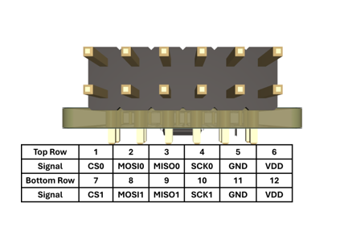

# PMOD SPI Memory PCB Board

This is a PMOD module which has space for two SPI memories. Supported footprints are:
* SOIC-8 150 mil and SOIC-8 200 mil (combined in one footprint)
* TSSOP-8 

SOIC-8 footprints are on the topside and TSSOP-8 are on the backside. 

**IMPORTANT:** For one footprint either the SOIC-8 footprint can be used or TSSO-8 both *cannot* be used at once. 

1st SPI memory can either be soldered on U0 or U1 (U0 and U1 cannot both be used at once)

2nd SPI memory can either be soldered on U2 or U3 (U2 and U3 cannot both be used at once)

## PMOD Pinout
The PMOD connector pinout follows the [specification from Digilent](https://digilent.com/reference/pmod/start)

